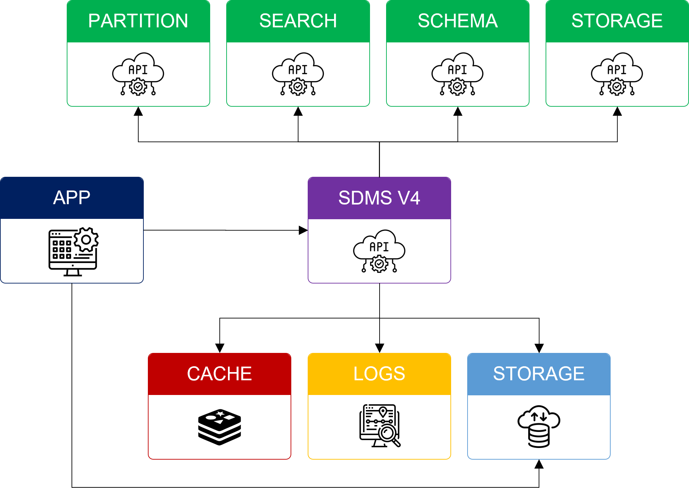

# Seismic Data Management Service V4

The Seismic Data Management Service (SDMS V4) is a cloud-based solution designed to store and manage data types as defined by the [Data Definition OSDU Authority](https://community.opengroup.org/osdu/data/data-definitions). The APIs provide strong data type check and fully integrated with OSDU policy service. It targets to reduce ambiguity of authorization model and promote easy adoption with consistent usage pattern.

<div align="center">
<br/>

<br/>
</div>

## Build Requirements

SDMS V4 is a Typescript web service that requires [NodeJs](https://nodejs.org) to be transpiled and executed. It also needs a running instance of [Redis](https://redis.io/) to enable its internal caching capabilities at runtime.

```bash
# NodeJs is a required software to build the web service.
$ node --version
v18.13.0

# Redis is required software to execute the web service.
$ redis-server --version
Redis server v=6.0.16
```

## Build the service

```bash
# navigate to the sdms-v4 sources root folder
$ cd app/sdms-v4

# install required dependencies
$ npm install

# build the service
$ npm run build
```

## Run the service Locally { AWS }

The AWS provider has been removed from this repository.

## Run the service Locally { Azure }

```bash
# start redis server instance
$ redis-server

# set required configurations in env
$ export AZURE_TENANT_ID={service_principal_tenant_id} \
  && export AZURE_CLIENT_ID={service_principal_client_id} \
  && export AZURE_CLIENT_SECRET={service_principal_client_secret} \
  && export CLOUD_PROVIDER=azure \
  # the azure keyvault id where secrets are stored
  && export KEYVAULT_URL={keyvault_id} \
  # the host url where core services, like storage service, run
  && export CORE_SERVICE_HOST={core_service_host_url} \
  # set the redis server instance host
  && export REDIS_HOST=127.0.0.1 \
  # set the redis server instance port
  && export REDIS_PORT=6379 \
  # disable TLS for local running instances
  && export REDIS_TLS_DISABLE=true \
  # local running instances of redis does not requires password
  && export REDIS_PWD_DISABLE=true

# start the service
npm run start-service
```

## Adding support to a new data type

To add support to a new data type in sdms-v4, a new entry is required to be created in the main configuration file [src/apis/schema/types.ts](src/apis/schema/types.ts). The new configuration entry must specify the following properties:

| Property             | Type    | Required | Description                                                                                                                         |
| -------------------- | ------- | -------- | ----------------------------------------------------------------------------------------------------------------------------------- |
| **name**             | string  | yes      | the endpoint name                                                                                                                   |
| **kind**             | string  | yes      | the data type model kind                                                                                                            |
| **hasBulks**         | boolean | no       | defined if the data type require support for bulk data                                                                              |
| **docBulkExtension** | string  | no       | an example of the associated bulk data extension - required for documentation purposes only if the hasBulks property is set to true |
| **docDataType**      | string  | yes      | the data type name - required for documentation purposes only                                                                       |

### Example: adding support for SEGY data type

```typescript
{
    name: 'segy',
    kind: 'osdu:wks:dataset--FileCollection.SEGY:1.0.0',
    docDataType: 'SEGY',
    hasBulks: true,
    docBulkExtension: 'sgy'
}
```

## Generates client libraries

The sdms-v4 solution provide a script to automatically generates service client libraries for different programming languages. Please refer to the package [README](./cli/README.md) for detailed instructions and supported languages.
