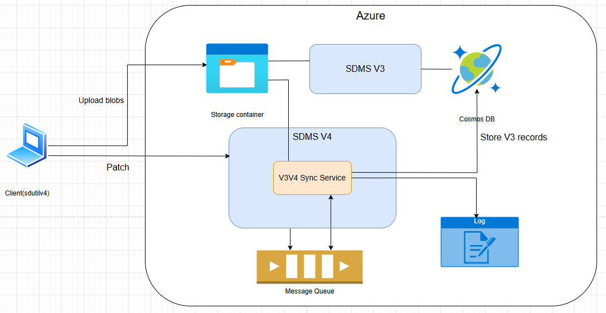
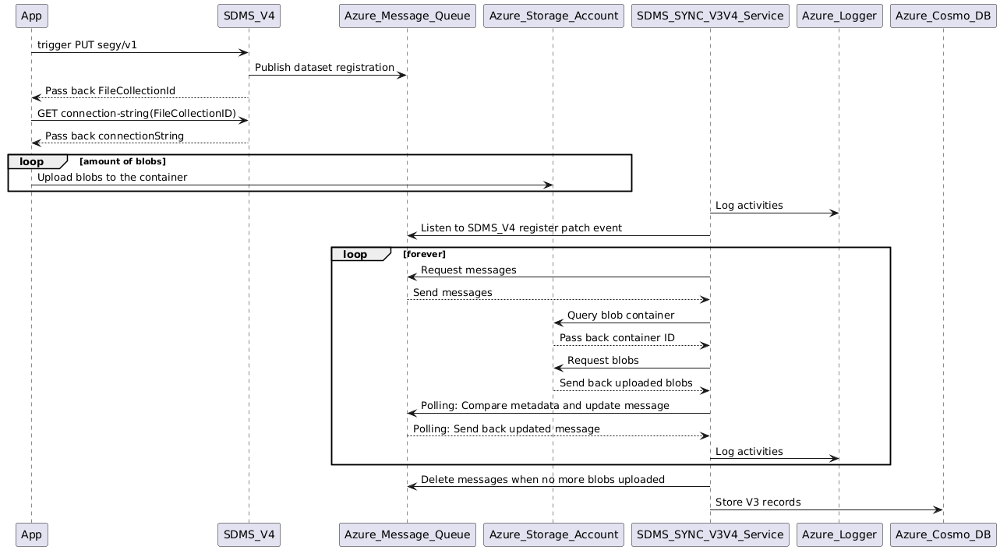

# Sync V3V4 service

This service is a synchronization mechanism within the advanced solution (V4) and the generic solution (V3) to ensure it can read and interpret data ingested by V4, despite the two solutions having fundamentally different architectural frameworks. This enhancement is critical for uninterrupted seismic data access as SLB applications plan their transition to V4.

## Overview

This microservice acts as a bridge between the two solutions by integrating with V4 and creating a metadata record in Cosmos DB each time data is ingested through V4. By generating these metadata records, V3 will be able to read and interpret data ingested through V4, ensuring data consistency and accessibility across both systems

## How it works

The V3V4 Sync service is a TypesScript-based sidecar service runs alongside the SDMS V4. Its purpose is to keep SDMS V3 synchronized with V4 for backward compatibility. When a client uploads files, the service running an infinite loop, constantly listening to message queue for changes. Detected updates are processed and create a corresponding V3 record and stores it Cosmos DB. All sync activities are logged.

### Architecture Diagrams

Component diagram:



Sequence diagram:



> Note:
> Please refer to this [ADR](<[http](https://community.opengroup.org/osdu/platform/domain-data-mgmt-services/seismic/seismic-dms-suite/seismic-store-service/-/issues/111)>)
> for detailed information.

### Start Service

Prerequisites:

- Node.js
- Npm
- Access to Azure resources and environment secrets

```bash
AZURE_CLIENT_ID: "00000000-0000-0000-0000-000000000000",
AZURE_TENANT_ID: "00000000-0000-0000-0000-000000000000",
AZURE_CLIENT_SECRET: "<client secret>",
CLOUD_PROVIDER: "<cloud-provider>",
KEYVAULT_URL: "<keyvault-url>",
CORE_SERVICE_HOST: "<host-url>",
LOGGER_ENABLED: "true"
```

Run

```console
npm install
npm run build
npm run start
```

### TODO

- **Cloud provider support**: This service is currently built exclusively for Azure. Future versions may include support for other cloud providers depending on the project requirements.

- **Polling mechanism limitation:** The current implementation uses a polling mechanism to listen for blobs upload events. Future enhancements could explore more reliable approaches to better handle scenarios like interrupted or delayed uploads
