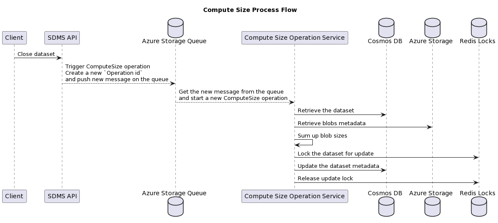

# Compute Size Runner

This project provides the Azure implementation for the async operation for computing sizes of the datasets.

## Overview

Computing the actual size of datasets can be a long-running operation which requires the process to run asynchronously. There are a number of tasks that need to be handled during
the operation, including the following:

- Queuing requests from the front-facing API.
- Dequeuing request in the backend.
- Listing the blobs metadata from Azure Blob Storage.
- Locking the datasets for updating the metadata.
- Updating the dataset metadata in CosmosDB.

The following diagram provides an overview for the flow of the Compute Size operation.



> Note:
> Please refer to this [ADR](https://community.opengroup.org/osdu/platform/domain-data-mgmt-services/seismic/seismic-dms-suite/seismic-store-service/-/issues/108)
> for more information about retrieving the size of the dataset.

## Developer Tips

This project provides an [.env.example](.env.example) file that provides the base environment variables needed to run/debug the service.

| Name                                | Description                                                                                                                                                                                                                                                                                                                                                                                                                                                                                                                                                               | Example                                                                                                                                             |
|-------------------------------------|---------------------------------------------------------------------------------------------------------------------------------------------------------------------------------------------------------------------------------------------------------------------------------------------------------------------------------------------------------------------------------------------------------------------------------------------------------------------------------------------------------------------------------------------------------------------------|-----------------------------------------------------------------------------------------------------------------------------------------------------|
| __HOST_PORT__                       | On which local port to expose the health-check endpoints.                                                                                                                                                                                                                                                                                                                                                                                                                                                                                                                 | "8001",                                                                                                                                             |
| __SDMS_KEYVAULT_URL__               | Required. Keyvault url stores secret values for all partitions (for cosmos, redis, account storage), while secret names are provided by the DES service. Also stores the Application Resource Id.                                                                                                                                                                                                                                                                                                                                                                         | "<https://kv-4e37ckkpdir6i.vault.azure.net>"                                                                                                        |
| __SDMS_COMPUTE_SIZE_QUEUE__         | The name of the storage queue to use for submitting compute size operation tasks.<br /><br /> If not specified, a default queue name will be used.                                                                                                                                                                                                                                                                                                                                                                                                                        | sdms-queue-computesize                                                                                                                              |
| __SDMS_COSMOS_ENDPOINT__            | The url for the Cosmos instance.<br /><br />This value can be found in the deployment in the Cosmos instance that stores the metadata for SDMS.<br /><br />This value is required if the __DES_SERVICE_HOST__ is not supplied.                                                                                                                                                                                                                                                                                                                                            |                                                                                                                                                     |
| __SDMS_COSMOS_KEY__                 | The key for the Cosmos instance.<br /><br />This value can be found in the deployment in the Cosmos instance that stores the metadata for SDMS.<br /><br />This value is required if the __DES_SERVICE_HOST__ is not supplied.                                                                                                                                                                                                                                                                                                                                            | primary/secondary or Cosmos key                                                                                                                     |
| __SDMS_STORAGE_CONNSTR__            | The connection string for the Azure Storage used to hold the datasets<br /><br />This value is required if the __DES_SERVICE_HOST__ is not supplied.                                                                                                                                                                                                                                                                                                                                                                                                                      | DefaultEndpointsProtocol=https;AccountName=some-account;AccountKey=some_account_key;EndpointSuffix=core.windows.net                                 |
| __SDMS_REDIS_LOCKS_HOSTNAME__       | Host of the Redis instance that handles the dataset locks.<br /><br />  In the typical Azure deployment, this Redis instance starts with the prefix `queue`.<br /><br />This value is required if the __DES_SERVICE_HOST__ is not supplied.                                                                                                                                                                                                                                                                                                                               | queue-xxxxx.redis.cache.windows.net                                                                                                                 |
| __SDMS_REDIS_LOCKS_PASSWORD__       | Host for the Redis instance that handles the dataset locks.<br /><br /> This value is required if the __DES_SERVICE_HOST__ is not supplied.                                                                                                                                                                                                                                                                                                                                                                                                                               | password                                                                                                                                            |
| __DES_SERVICE_HOST__                | If supplied, the deletion service will make a call to the DES instance to retrieve values for the deployment and the related tenant (data-partition-id) that is passed in when a request for deletion is generated.<br /><br />This value can be found in the typical Azure deployment, please see the section below for details on how to find it.                                                                                                                                                                                                                       | <https://sdmstest00.oep.ppe.azure-int.net>                                                                                                          |
| __AZURE_CLIENT_ID__                 | The Application (Client) Id under which the service is to be run. The App Registration (Service Principal) must have access to the deployed SDMS Azure resources.<br /><br />The App Registration must be created by an individual with enough rights on the Azure subscription.<br /><br />Optional:  If supplied this value will be picked up during execution and used by the `DefaultAzureCredential` in the service.<br /><br />More information can be found [here](https://learn.microsoft.com/dotnet/api/azure.identity.environmentcredential?view=azure-dotnet). | 00000000-0000-0000-0000-000000000000                                                                                                                |
| __AZURE_CLIENT_SECRET__             | The secret for the Application (Client).<br /><br />Optional:  If supplied this value will be picked up during execution and used by the `DefaultAzureCredential` in the service.<br /><br />More information can be found [here](https://learn.microsoft.com/dotnet/api/azure.identity.environmentcredential?view=azure-dotnet).                                                                                                                                                                                                                                         | some_secret_key                                                                                                                                     |
| __AZURE_TENANT_ID__                 | The Azure Tenant Id of the deployment.<br /><br />Optional:  If supplied this value will be picked up during execution and used by the `DefaultAzureCredential` in the service.<br /><br />More information can be found [here](https://learn.microsoft.com/dotnet/api/azure.identity.environmentcredential?view=azure-dotnet).                                                                                                                                                                                                                                           |                                                                                                                                                     |
| __APPINSIGHTS_INSTRUMENTATION_KEY__ | The Application Insights Instrumentation Key                                                                                                                                                                                                                                                                                                                                                                                                                                                                                                                              | secret                                                                                                                                              |
| __Logging__LogLevel__Default__      | Logging level configuration for the logging provider.<br /><br />Optional: If supplied, will override the default logging level.<br /><br />More information can be found [here](https://learn.microsoft.com/dotnet/core/extensions/logging?tabs=command-line#set-log-level-by-command-line-environment-variables-and-other-configuration)                                                                                                                                                                                                                                | 1 <br /><br />The details of the levels can be found [here](https://learn.microsoft.com/dotnet/core/extensions/logging?tabs=command-line#log-level) |

Example:

This is similar to the values in the typical Azure deployment. The `DES Service` provides the connection string for the Cosmos instance and the storage account. If you use `DES_SERVICE_HOST` you need to provide only these environment variables:

```bash
SDMS_COMPUTE_SIZE_QUEUE='computesize-job-queue-test'
SDMS_KEYVAULT_URL='https://kv-xxx.vault.azure.net/'
DES_SERVICE_HOST='https://sdmstest.oep.ppe.azure-int.net'
Logging__LogLevel__Debug=1
AZURE_CLIENT_ID='00000000-0000-0000-0000-000000000000'
AZURE_CLIENT_SECRET='<client secret>'
AZURE_TENANT_ID='00000000-0000-0000-0000-000000000000'
```

Please refer to [Sidecar.DeleteOperationRunner README](../Sidecar.DeleteOperationRunner/README.md) for more Developer tips.
