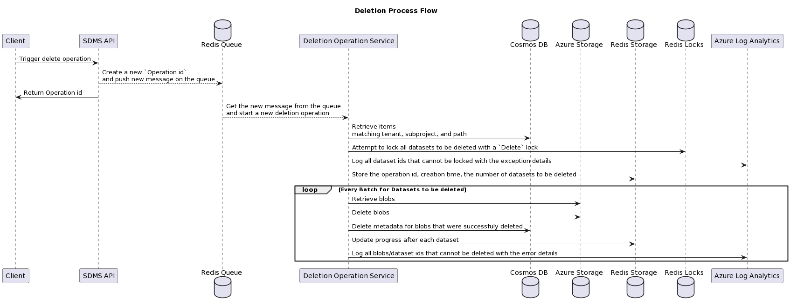
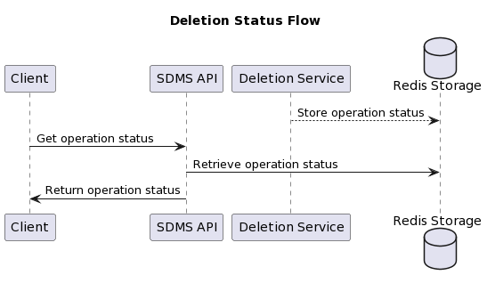

# Delete Operation Runner

This project provides the Azure implementation for the long-running deletion operation which is responsible for the bulk deletion of datasets and their associated metadata.

## Overview

Deleting a large number of datasets can be a long-running operation which requires the process to run asynchronously.  There are a number of tasks that need to be handled during
the operation, including the following:

- Queuing requests from the front-facing API.
- Dequeuing requests in the backend.
- Reporting the status of deletion.
- Building the queue of datasets to be deleted.
- Locking the datasets for deletion.
- Deletion of the associated blobs.
- Deletion of the associated metadata.

The following diagram provides an overview for the flow of the deletion operation.



As the process runs in the background and can take a long time, the deletion operation will provide the status of the long-running operation.



> Note:
> Please refer to this [ADR]([http](https://community.opengroup.org/osdu/platform/domain-data-mgmt-services/seismic/seismic-dms-suite/seismic-store-service/-/issues/107))
> for detailed information.

## Developer Tips

This project provides an [.env.example](.env.example) file that provides the base environment variables needed to run/debug the service.

| Name                                | Description                                                                                                                                                                                                                                                                                                                                                                                                                                                                                                                                                               | Example |
|-------------------------------------|---------------------------------------------------------------------------------------------------------------------------------------------------------------------------------------------------------------------------------------------------------------------------------------------------------------------------------------------------------------------------------------------------------------------------------------------------------------------------------------------------------------------------------------------------------------------------| - |
| __HOST_PORT__                       | On which local port to expose the health-check endpoints.                                                                                                                                                                                                                                                                                                                                                                                                                                                                                                                  | "8001",
| __SDMS_KEYVAULT_URL__               | Required. Keyvault url stores secret values for all partitions (for cosmos, redis, account storage), while secret names are provided by the DES service. Also stores the Application Resource Id.                                                                                                                                                                                                                                                                                                                                                                           | "<https://kv-4e37ckkpdir6i.vault.azure.net/>",
| __SDMS_REDIS_QUEUE_HOSTNAME__       | Host of the Redis instance that holds the queue for deletion operations.<br /><br />  In the typical Azure deployment, this Redis instance starts with the prefix `cache`.<br /><br />This value is required if the __DES_SERVICE_HOST__ is not supplied.                                                                                                                                                                                                                                                                                                                 | cache-xxxxx.redis.cache.windows.net:6380,password=password_here,ssl=True,abortConnect=False   |
| __SDMS_REDIS_QUEUE_PASSWORD__       | Password for the Redis instance that holds the queue for deletion operations.<br /><br />  This value is required if the __DES_SERVICE_HOST__ is not supplied.                                                                                                                                                                                                                                                                                                                                                                                                            | password  |
| __SDMS_REDIS_QUEUE_NAME__           | The name of the queue in Redis; the queue is of type `List`.<br /><br />This value is always required.                                                                                                                                                                                                                                                                                                                                                                                                                                                                    | delete-job-queue   |
| __STORAGE_QUEUE_NAME__              | The name of the storage queue to use for submitting deletion tasks.<br /><br /> If not specified, a default queue name will be used.                                                                                                                                                                                                                                                                                                                                                                                                                                                                    | delete-job-queue   |
| __SDMS_COSMOS_ENDPOINT__            | The url for the Cosmos instance.<br /><br />This value can be found in the deployment in the Cosmos instance that stores the metadata for SDMS.<br /><br />This value is required if the __DES_SERVICE_HOST__ is not supplied.                                                                                                                                                                                                                                                                                                                                            |    |
| __SDMS_COSMOS_KEY__                 | The key for the Cosmos instance.<br /><br />This value can be found in the deployment in the Cosmos instance that stores the metadata for SDMS.<br /><br />This value is required if the __DES_SERVICE_HOST__ is not supplied.                                                                                                                                                                                                                                                                                                                                            |  primary/secondary or Cosmos key |
| __SDMS_STORAGE_CONNSTR__            | The connection string for the Azure Storage used to hold the datasets<br /><br />This value is required if the __DES_SERVICE_HOST__ is not supplied.                                                                                                                                                                                                                                                                                                                                                                                                                      |  DefaultEndpointsProtocol=https;AccountName=some-account;AccountKey=some_account_key;EndpointSuffix=core.windows.net  |
| __SDMS_REDIS_LOCKS_HOSTNAME__       | Host of the Redis instance that handles the dataset locks.<br /><br />  In the typical Azure deployment, this Redis instance starts with the prefix `queue`.<br /><br />This value is required if the __DES_SERVICE_HOST__ is not supplied.                                                                                                                                                                                                                                                                                                                               | queue-xxxxx.redis.cache.windows.net |
| __SDMS_REDIS_LOCKS_PASSWORD__       | Host for the Redis instance that handles the dataset locks.<br /><br /> This value is required if the __DES_SERVICE_HOST__ is not supplied.                                                                                                                                                                                                                                                                                                                                                                                                                               | password   |
| __DES_SERVICE_HOST__                | If supplied, the deletion service will make a call to the DES instance to retrieve values for the deployment and the related tenant (data-partition-id) that is passed in when a request for deletion is generated.<br /><br />This value can be found in the typical Azure deployment, please see the section below for details on how to find it.                                                                                                                                                                                                                       |  <https://sdmstest00.oep.ppe.azure-int.net>  |
| __AZURE_CLIENT_ID__                 | The Application (Client) Id under which the service is to be run. The App Registration (Service Principal) must have access to the deployed SDMS Azure resources.<br /><br />The App Registration must be created by an individual with enough rights on the Azure subscription.<br /><br />Optional:  If supplied this value will be picked up during execution and used by the `DefaultAzureCredential` in the service.<br /><br />More information can be found [here](https://learn.microsoft.com/dotnet/api/azure.identity.environmentcredential?view=azure-dotnet). |  00000000-0000-0000-0000-000000000000  |
| __AZURE_CLIENT_SECRET__             | The secret for the Application (Client).<br /><br />Optional:  If supplied this value will be picked up during execution and used by the `DefaultAzureCredential` in the service.<br /><br />More information can be found [here](https://learn.microsoft.com/dotnet/api/azure.identity.environmentcredential?view=azure-dotnet).                                                                                                                                                                                                                                         | some_secret_key   |
| __AZURE_TENANT_ID__                 | The Azure Tenant Id of the deployment.<br /><br />Optional:  If supplied this value will be picked up during execution and used by the `DefaultAzureCredential` in the service.<br /><br />More information can be found [here](https://learn.microsoft.com/dotnet/api/azure.identity.environmentcredential?view=azure-dotnet).                                                                                                                                                                                                                                           |    |
| __APPINSIGHTS_INSTRUMENTATION_KEY__ | The Application Insights Instrumentation Key                                                                                                                                                                                                                                                                                                                                                                                                                                                                                                                              | secret   |
| __Logging__LogLevel__Default__      | Logging level configuration for the logging provider.<br /><br />Optional: If supplied, will override the default logging level.<br /><br />More information can be found [here](https://learn.microsoft.com/dotnet/core/extensions/logging?tabs=command-line#set-log-level-by-command-line-environment-variables-and-other-configuration)                                                                                                                                                                                                                                |  1 <br /><br />The details of the levels can be found [here](https://learn.microsoft.com/dotnet/core/extensions/logging?tabs=command-line#log-level)  |

Example:

This is similar to the values in the typical Azure deployment. The `DES Service` provides the connection string for the Cosmos instance and the storage account.

```bash
SDMS_REDIS_QUEUE_NAME='delete-job-queue-test'
STORAGE_QUEUE_NAME='delete-job-queue-test'
SDMS_KEYVAULT_URL='https://kv-xxx.vault.azure.net/'
DES_SERVICE_HOST='https://sdmstest.oep.ppe.azure-int.net'
Logging__LogLevel__Debug=1
AZURE_CLIENT_ID='00000000-0000-0000-0000-000000000000'
AZURE_CLIENT_SECRET='<client secret>'
AZURE_TENANT_ID='00000000-0000-0000-0000-000000000000'
```

We can also overwrite the connection strings for the Cosmos instance, storage account, Redis instances:

```bash
SDMS_REDIS_QUEUE_HOSTNAME='cache-xxx.redis.cache.windows.net'
SDMS_REDIS_QUEUE_PASSWORD='<some password>'
SDMS_REDIS_QUEUE_NAME='<queue-name>'
STORAGE_QUEUE_NAME='<queue-name>'
SDMS_COSMOS_KEY='<primary/secondary Cosmos Key>'
SDMS_COSMOS_ENDPOINT='https://db-xxx.documents.azure.com:443/'
SDMS_STORAGE_CONNSTR='DefaultEndpointsProtocol=https;AccountName=<account-name>;AccountKey=<some account key>;EndpointSuffix=core.windows.net'
SDMS_REDIS_LOCKS_HOSTNAME='queue-xxx.redis.cache.windows.net'
SDMS_REDIS_LOCKS_PASSWORD='<some password>'
SDMS_KEYVAULT_URL='https://kv-xxx.vault.azure.net/'
DES_SERVICE_HOST='https://sdmstest.oep.ppe.azure-int.net'
Logging__LogLevel__Debug=1
AZURE_CLIENT_ID='00000000-0000-0000-0000-000000000000'
AZURE_CLIENT_SECRET='<client secret>'
AZURE_TENANT_ID='00000000-0000-0000-0000-000000000000'
```

If we want to avoid the calls to the `DES Service` while running locally, we can omit the `DES_SERVICE_HOST`.
If we omit it, then we need to add the connection strings for the storage account and the cosmos instance.

```bash
SDMS_REDIS_QUEUE_NAME='delete-job-queue-test'
STORAGE_QUEUE_NAME='delete-job-queue-test'
SDMS_COSMOS_KEY='<primary/secondary Cosmos Key>'
SDMS_COSMOS_ENDPOINT='https://db-xxx.documents.azure.com:443/'
SDMS_STORAGE_CONNSTR='DefaultEndpointsProtocol=https;AccountName=<some account name>;AccountKey=<some account key>;EndpointSuffix=core.windows.net'
SDMS_KEYVAULT_URL='https://kv-xxx.vault.azure.net/'
Logging__LogLevel__Debug=1
```

### How to find DES Service URL

This value can be found using the following steps:

- In the Azure portal, find the Kubernetes Service for the SDMS deployment
- In the blade, under `Kubernetes resources`, select `Configuration`
- In the next blade, apply the `Filter by namespace` of `ddms-seismic`
- Select `seismic-ddms-config` from the results
- Under `Data` retrieve the value for `DES_SERVICE_HOST`

### VSCode Configuration Examples

In order to run and debug the application using VSCode, one will have to make modifications to `launch.json` and `tasks.json` in the local `.vscode`
folder.

To facilitate this process, the following examples have been provided.

#### launch.json

```json
{
    "version": "0.2.0",
    "configurations": [
        {
            // Use IntelliSense to find out which attributes exist for C# debugging
            // Use hover for the description of the existing attributes
            // For further information visit https://github.com/dotnet/vscode-csharp/blob/main/debugger-launchjson.md
            "name": ".NET Core Launch (web)",
            "type": "coreclr",
            "request": "launch",
            "preLaunchTask": "build",
            // If you have changed target frameworks, make sure to update the program path.
            "program": "${workspaceFolder}/bin/Debug/net6.0/Sidecar.dll",
            "args": [],
            "cwd": "${workspaceFolder}",
            "stopAtEntry": false,
            // Enable launching a web browser when ASP.NET Core starts. For more information: https://aka.ms/VSCode-CS-LaunchJson-WebBrowser
            "serverReadyAction": {
                "action": "openExternally",
                "pattern": "\\bNow listening on:\\s+(https?://\\S+)"
            },
            "env": {
                "ASPNETCORE_ENVIRONMENT": "Development"
            },
            "sourceFileMap": {
                "/Views": "${workspaceFolder}/Views"
            }
        },
        {
            "name": "Delete Operation Runner launcher",
            "type": "coreclr",
            "request": "launch",
            "preLaunchTask": "buildRedisDeleteOperationRunner",
            "program": "${workspaceFolder}/src/Sidecar.DeleteOperationRunner/bin/Debug/net6.0/Sidecar.DeleteOperationRunner.dll",
            "args": [],
            "cwd": "${workspaceFolder}/src",
            "envFile": "${workspaceFolder}/src/Sidecar.DeleteOperationRunner/.env",
            "console": "internalConsole",
            "stopAtEntry": false,
        },
        {
            "name": ".NET Core Attach",
            "type": "coreclr",
            "request": "attach"
        }
    ]
}
```

#### tasks.json

```json
{
    "version": "2.0.0",
    "tasks": [
        {
            "label": "build",
            "command": "dotnet",
            "type": "process",
            "args": [
                "build",
                "${workspaceFolder}/src/Sidecar.QueryRunner/Sidecar.QueryRunner.csproj",
                "/property:GenerateFullPaths=true",
                "/consoleloggerparameters:NoSummary"
            ],
            "problemMatcher": "$msCompile"
        },
        {
            "label": "publish",
            "command": "dotnet",
            "type": "process",
            "args": [
                "publish",
                "${workspaceFolder}/src/Sidecar.QueryRunner/Sidecar.QueryRunner.csproj",
                "/property:GenerateFullPaths=true",
                "/consoleloggerparameters:NoSummary"
            ],
            "problemMatcher": "$msCompile"
        },
        {
            "label": "watch",
            "command": "dotnet",
            "type": "process",
            "args": [
                "watch",
                "run",
                "--project",
                "${workspaceFolder}/src/Sidecar.QueryRunner/Sidecar.QueryRunner.csproj"
            ],
            "problemMatcher": "$msCompile"
        },

        {
            "label": "buildRedisDeleteOperationRunner",
            "command": "dotnet",
            "type": "process",
            "args": [
                "build",
                "${workspaceFolder}/src/Sidecar.DeleteOperationRunner/Sidecar.DeleteOperationRunner.csproj",
                "/property:GenerateFullPaths=true",
                "/consoleloggerparameters:NoSummary"
            ],
            "problemMatcher": "$msCompile"
        },
        {
            "label": "publishRedisDeleteOperationRunner",
            "command": "dotnet",
            "type": "process",
            "args": [
                "publish",
                "${workspaceFolder}/src/Sidecar.DeleteOperationRunner/Sidecar.DeleteOperationRunner.csproj",
                "/property:GenerateFullPaths=true",
                "/consoleloggerparameters:NoSummary"
            ],
            "problemMatcher": "$msCompile"
        },
        {
            "label": "watchRedisDeleteOperationRunner",
            "command": "dotnet",
            "type": "process",
            "args": [
                "watch",
                "run",
                "--project",
                "${workspaceFolder}/src/Sidecar.DeleteOperationRunner/Sidecar.DeleteOperationRunner.csproj"
            ],
            "problemMatcher": "$msCompile"
        }
    ]
}
```
